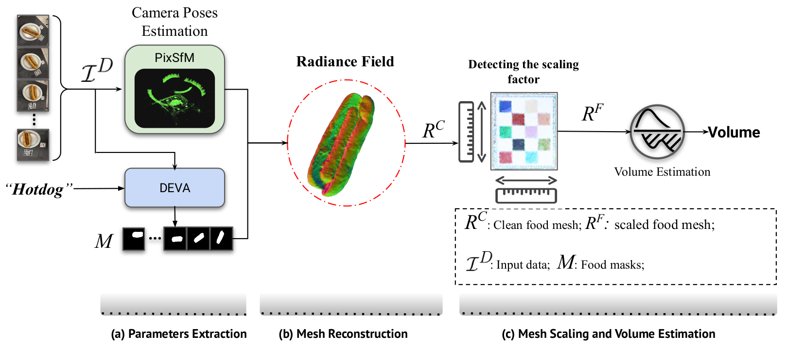
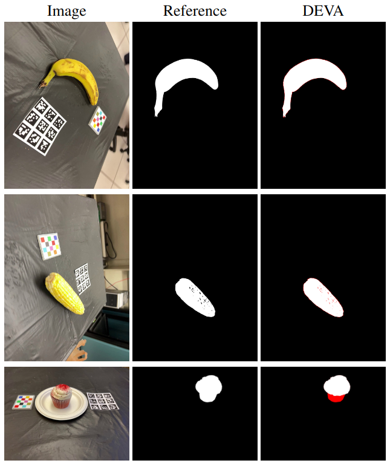
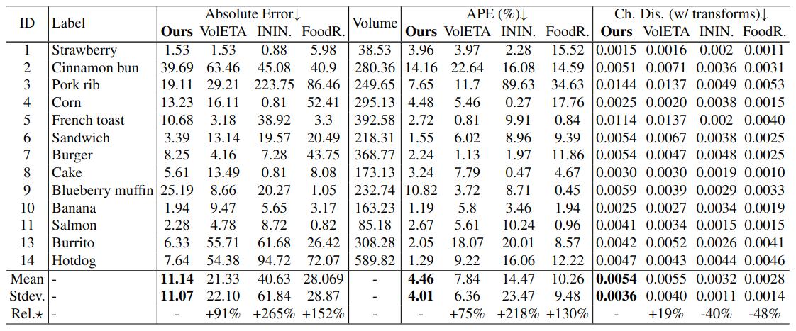
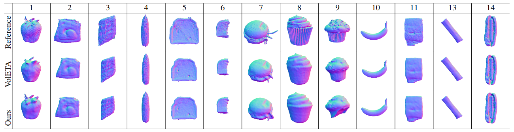

<div align="center">
  <h1>VolTex: Food Volume Estimation using Text-Guided Segmentation and Neural Surface Reconstruction</h1>
  <p>
    <a href="https://www.linkedin.com/in/amughrabi/">Ahmad AlMughrabi*</a>, 
    <a href="https://www.linkedin.com/in/umair-haroon-8729611ab">Umair Haroon*</a>, 
    <a href="https://www.linkedin.com/in/ricardo-marques-a3128847/">Ricardo Marques* ¹</a>, 
    <a href="https://www.linkedin.com/in/petia-radeva-71651334/">Petia Radeva* ²</a>
  </p>
  <p>
    AIBA Lab @ <a href="https://web.ub.edu/web/ub/">UB</a> (Universitat de Barcelona)*,
    Computer Vision Center ¹,
    Institut de Neurosciències ²
  </p>
</div>

-----

## Table of Contents

- [Introduction](#introduction)
- [Installation](#installation)
- [Usage](#usage)
- [Methodology](#methodology)
- [Submodules](#submodules)
- [Results](#results)
- [License](#license)
- [Acknowledgements](#acknowledgements)

-----

## Introduction

Accurate food volume estimation is essential for various applications, including dietary monitoring, medical nutrition management, and food intake analysis. Traditional methods for 3D food volume estimation typically excel at calculating volume but often fall short when it comes to selecting specific food portions. 

VolTex addresses this gap by providing an innovative framework that enhances food object selection during volume estimation. Our solution allows users to specify a target food item via text input, enabling the precise segmentation of specific food objects within real-world scenes. Once an object is segmented, our method reconstructs it using Neural Surface Reconstruction techniques, producing high-fidelity 3D meshes for accurate volume calculation.

In our extensive evaluations using the MetaFood3D dataset, VolTex has demonstrated superior performance in isolating and reconstructing food items, leading to improved accuracy in volume estimation. Whether you're a researcher, developer, or enthusiast in the field of food technology, we invite you to explore our framework and contribute to advancing the capabilities of food volume estimation.

### Features

- Text-based food item selection for precise segmentation.
- High-fidelity 3D mesh reconstruction using Neural Surface Reconstruction
- Thorough evaluation on the MetaFood3D dataset

We encourage you to check out the documentation for installation instructions, usage details, and contributions. Let’s revolutionize the way we estimate food volume together!

### Our Framework




## Installation:

To get started, clone this repository:

```bash 
git clone https://github.com/GCVCG/VolTex.git

```

### Requirements

- Python 3.8+
- PyTorch 1.10+
- torchvision
- numpy
- pandas
- scikit-learn
- matplotlib
- OpenCV

You can install the required packages using pip:

```bash
pip install -r requirements.txt
```

## Submodules

Please note that this project relies on several submodules that are not included in this repository. You must clone and install these submodules from their respective repositories:

1. [Pixel-Perfect Structure-from-Motion with Featuremetric Refinement](https://arxiv.org/pdf/2108.08291)
      - Repository: [Pixel-Perfect-SfM](https://github.com/cvg/pixel-perfect-sfm)

2. [Tracking Anything with Decoupled Video Segmentation (DEVA)](https://openaccess.thecvf.com/content/ICCV2023/html/Cheng_Tracking_Anything_with_Decoupled_Video_Segmentation_ICCV_2023_paper.html)
      - Repository: [DEVA](https://github.com/hkchengrex/Tracking-Anything-with-DEVA)

3. [NeuS2: Fast Learning of Neural Implicit Surfaces for Multi-view Reconstruction](https://arxiv.org/abs/2212.05231)
      - Repository: [NeuS2](https://github.com/19reborn/NeuS2?tab=readme-ov-file)

## Usage

After installing the necessary packages and submodules, you can run the main script to the Pipeline:

```bash
python main.py --config configs/config.yaml #Example
```
## Methodology

### Data:
We used the dataset Provided by MetaFood CVPR Workshop Challenge 2024. We used 13 food scenes categorized by difficulty (simple, medium).  

You can download the data from Kaggle: [MTF Challenge Dataset](https://www.kaggle.com/competitions/cvpr-metafood-3d-food-reconstruction-challenge/data)

### Evaluation
A two-phase evaluation process focuses on the precision of reconstructed 3D models in terms of shape and portion size.

#### Portion Size Evaluation:
- Metric: Mean Absolute Percentage Error (MAPE).
- Focus: Accuracy of volume estimation of 3D models.

#### Shape Evaluation:
- Eligibility: Top teams from Phase-I.
- Requirement: Submission of complete 3D mesh files for each food item.
- Metric: Chamfer distance.
- Focus: Accuracy of 3D shape reconstruction.

### DEVA Comparison with Reference Masks

<div align="center">
  
</div>

### Quantitative Results



### Qualitative Results



## Acknowlegements
This work was partially funded by the EU project MUSAE (No. 01070421), 2021-SGR-01094 (AGAUR), Icrea Academia’2022 (Generalitat de Catalunya), Robo STEAM (2022-1-BG01-KA220-VET000089434, Erasmus+ EU), DeepSense (ACE053/22/000029, ACCIÓ), CERCA Programme/Generalitat de Catalunya, and Grants PID2022141566NB-I00 (IDEATE), PDC2022-133642-I00 (DeepFoodVol), and CNS2022-135480 (A-BMC) funded by MICIU/AEI/10.13039/501100 011033, by FEDER (UE), and by European Union NextGenerationEU/ PRTR. R. Marques acknowledges the support of the Serra Húnter Programme. A. AlMughrabi acknowledges the support of FPI Becas, MICINN, Spain. U. Haroon acknowledges the support of FI-SDUR Becas, MICINN, Spain.
    
